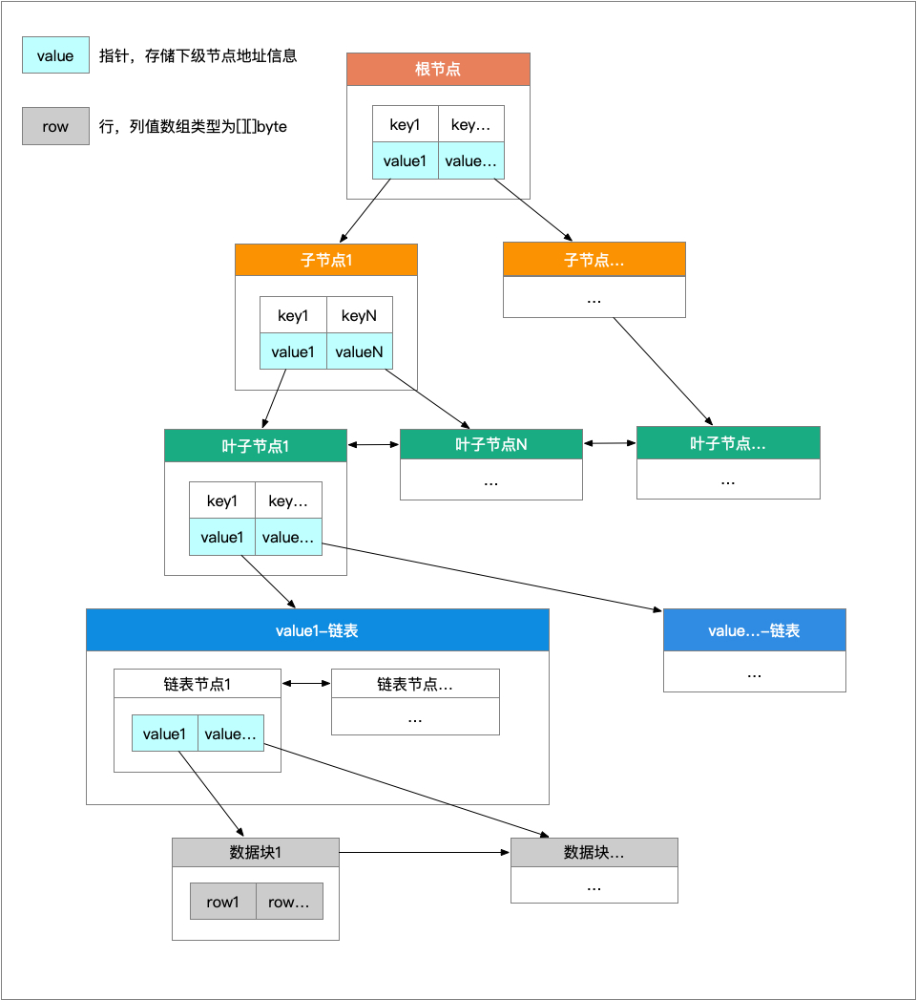

# 关系型数据库合约
分布式账本KV存储结构与传统关系型数据库结构结合，在分布式账本基础上建立关系型数据库索引。为了让传统应用更快接入到区块链中，设计通用数据结构和索引存储到区块链账本中，通过合约解析和写入，应用层无需转换结构，写入查询更加方便。

架构图:

由于关系型数据结构比KV写入代价更大，以下针对写入行代价分析：

```bash
写Key：表计数、块、索引(头信息、节点数据)
读Key：链、库、表、关系、计数、块、索引(头信息、节点数据)
```

假设块切分为N，索引树高为H，可以计算每次事务中写Key数量5~(3+N+H)，读Key数量8~(6+N+H)

```bash
N=1,H=1;WCount=5;RCount=8
N=1,H=3;WCount=5~7;RCount=8~10
N=1,H=5;WCount=5~9;RCount=8~12
N=1,H=10;WCount=5~14;RCount=8~17
...
```

不考虑N值情况，H是主要影响，H值过高是由于节点可存储容量限制，如何设计索引值是优先考虑。读基数8可合并块以上的配置到一个Key中，这样读基数减到5，但同时写会放大，如果H平均保持在3以下，读写Key总数量在10～15，在对一个事务10条行记录以上最佳，当行记录越多情况下影响的只有N值，由此可线性增长

## 元数据
任何存储数据结构都需要设计规范的元数据，合约中对账本、库、关系、表、行、列、块抽象设计标记、结构、依赖.

## 索引
基于KV存储的索引结构，传统的关系型数据库(如MySql)使用B+Tree树实现，KV存储大多数使用字典排序Key实现，由于分布式特点，底层存储数据库采用KV形式(LevelDB)，合约基于KV存储建立B+Tree树实现分布式账本索引.

索引树结构图:



1. 每个节点保存在一个Key中，每个节点设定容量(4KB)
2. 叶子节点不存真实行数据，所有行数据存入块中，根据块容量(4KB)进行切分，叶子节点通过指向块指针来查找到行数据
3. 叶子节点块指针数据过多会转换为双向链表，通过链表指针指向链表头依次查找到块指针数据
4. 双向链表是对叶子节点数据过多做的延伸，支持排序查找，一个节点容量(4KB)可存放512个64位块指针数据(8Byte)，按一个块4KB大小计算，一个节点可以指向2MB块数据，理论上块指针数据不会太多，如果需要扩展可以转换为跳跃表或B+Tree树

## 块
块是行数据存储空间，实际上多个事务不会存入到一个块中，块和事务N:1的关系，块的目的是对单个事务中小行数据合并、大行数据切分，块的Key用表来区分并依此递增，Value存入多行数据，如果出现切分块会存入切分位置，在查找行数据时候将对切分位置和下个块进行合并，以便获取完整的行数据

## 历史
Fabric本身可以支持历史版本，不过是针对Key和区块建立的，对于私有数据无法建立关系，由于行是属于块空间，为了防止更改行导致Key写入放大，故所有行记录操作会追加到新块中，再通过主键索引中叶子节点存入多个块指针(顺序插入)来指向多个事务版本的历史行数据

## 行
行数据为二维字节数组，数组中元素代表列值，行结构未包含列信息，通过列ID(列数组下标+1)对应，所有列为逻辑删除，列的修改只会影响到下一次行写入验证，而原行在查询时行中每个列值根据列配置解析(不同数据类型转换、删除过滤)，再重新组合成行返回

## 表
配置多个列、主键、外建关系，目前索引类型只支持主键和外键

1. 主键：列类型限制为Int，不可删除
2. 外键：列类型限制为Int，可以逻辑删除，但索引保留

## 表计数
行自增、增删改分别计数，表空间(虚拟空间)中块自增计数

## 表关系
目前只针对外键关系，为了保证多表之关联性，写入行强制验证外建关系，查询可通过外键自动连表查询

## 数据库
只定义前缀值，可匹配到表、表关系、表计数

## 操作
对库、表、表关系、列、行

1. 库：创建、删除、修改名称、查找
2. 表：创建、删除、修改名称、查找
3. 表关系：查找、删除、新增(由于需要建立索引数据，涉及Key数量较多，需要分多个事务执行)
4. 列：新增、删除、修改、查找
5. 行：新增、删除、修改、主键查找(支持区间、排序、分页)、外建查找(支持区间、排序、分页)、历史查找(支持排序)

## 事务
一次事务提交多个操作，多个操作按顺序执行，对每个操作会验证合法性、上下文依赖关系，返回操作结果数组
